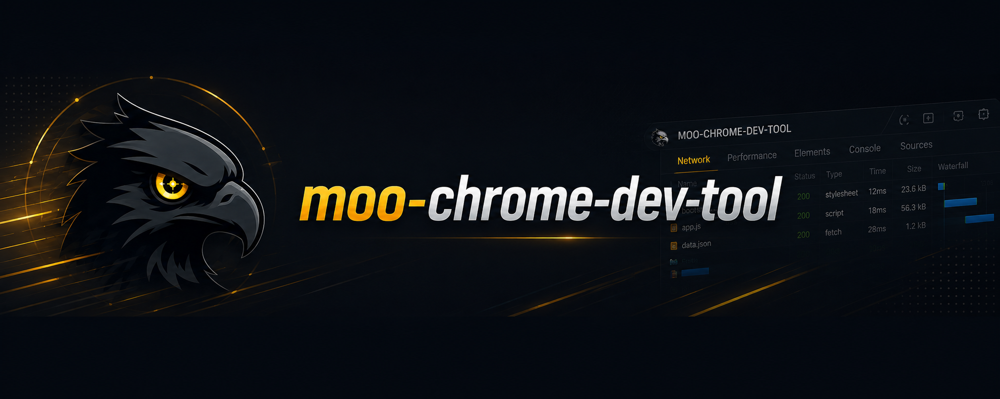

<p align="center">
  
</p>

# Moo Dev Tool

在出问题的页面上一键报 bug 的 Chrome 扩展——截图标注、网络请求、JS 报错、录屏自动打包进单，开发不用再追问现场。

## 它能帮你做什么

测试发现一个按钮点了没反应。以前你要：截图、打开 DevTools 抄请求、复制错误堆栈、回忆刚才点了哪、写一个能让开发看懂的描述，最后贴到群里或工单系统。

装上这个扩展之后：

1. 在出问题的页面点一下右下角悬浮球（或按 `⌘⇧B / Ctrl+Shift+B` 直接截图、`⌥⇧R / Alt+Shift+R` 录屏）
2. 在截图上画框圈出位置、加几个字
3. 写一行标题，按提交

扩展会自动把这些一起打包发到你团队的 bug 看板：

- 当时的页面截图（带你画的标注）和最近 30 秒录屏
- 这个页面最近发的网络请求（含请求体和响应，token 自动脱敏）
- 最近的 JS 报错
- 你提到的页面元素（按一下「选元素」点中即可，自动带 selector）
- 项目白名单里的 localStorage（比如登录 token、当前用户 id）

开发拿到这条 bug 不用再问「你怎么操作的」「请求长什么样」。

## 适合谁

- **测试**：报 bug 不再贴一张截图配半页文字描述
- **前端 / 后端**：自测时一键复盘现场，回查请求和报错
- **设计师**：看到样式问题直接圈出来发给前端
- **PM**：用户演示出问题时录屏 30 秒发给开发

不适合：纯线上用户反馈渠道（这是给团队内部用的，要登记 token）。

## 装上跑起来

**最低要求**：Chrome **111+**（2023 年初之后的 Chrome 都满足，基本不用单独升级）

**下载安装包**：去 [Releases](https://gitee.com/charsen/moo-chrome-dev-tool/releases) 下最新的 zip 解压。

**加载到 Chrome**：

1. 打开 `chrome://extensions/`
2. 右上角打开「开发者模式」
3. 点「加载已解压的扩展程序」，选刚才解压的目录
4. 点浏览器右上角的 Moo 图标，在弹窗里打开「**允许向上报服务器发送请求**」开关——**这步不做，悬浮球不会出现**。要用录屏的顺手把「录屏功能」也打开

**配一个项目**：

1. 在任意页面按 F12 打开 DevTools，找到「Moo」面板（不想开 F12？点 Moo 图标 → 底部「打开工作区」，界面一样）
2. 切到「环境」Tab，新建项目
3. 填项目名、要监控的网址（支持通配，比如 `https://*.example.com/*`）
4. 加一个服务器，把团队后端给你的接收地址填到「请求 URL」，token 填到「项目 Token」
5. 刷新页面，右下角出现 `M` 悬浮球就配好了

**报一个 bug**：

- 点悬浮球 → 截图 → 画框标注 → 填标题 → 提交
- 或者按 `⌘⇧B / Ctrl+Shift+B` 直接截图（悬浮球被页面挡住时好用）
- 或者按 `⌥⇧R / Alt+Shift+R` 开始录屏，最长 30 秒自动停（首次要先在 Moo 图标弹窗里开「录屏功能」）

## 后端怎么接

需要你团队的后端写两个 HTTP 接口：一个收提交，一个让扩展回查 bug 当前状态。

详细协议看 [`docs/SERVER_INTEGRATION.md`](docs/SERVER_INTEGRATION.md)，里面有 Node 示例可以直接抄。

用 Laravel 的话最省事——装 `composer require charsen/moo-scaffold`，自带接收接口和后台 UI。

## 内部多系统怎么办

公司内有 3 个系统要监控？在「环境」Tab 建 3 个项目，每个绑定自己的域名和上报地址。悬浮球会根据你当前所在网址自动切换到对应项目。

每个项目下还可以配多个服务器（比如开发环境、预发、线上各一份），提交时下拉选。

## 想从源码跑

```bash
pnpm install
pnpm dev      # 启动 Vite，产物输出到 dist/
```

然后在 `chrome://extensions` 加载 `dist/` 目录（同样要在 Moo 图标弹窗里开「允许向上报服务器发送请求」）。改页面端代码会自动重载；**改 service worker 代码要手动去 `chrome://extensions` 点 🔄**，否则跑的还是老代码。

要本地联调后端：

```bash
pnpm mock     # 起一个假后端在 http://localhost:8787/bugs/intake
```

在「环境」Tab 新建项目，URL 填 `http://localhost:*/*`（v0.7.0 起 chrome MV3 严格要求 `https?://host/path` 形态，单个 `*` / 无 scheme 不再支持），服务器地址填 `http://localhost:8787/bugs/intake`（mock 任意路径都收；`/intake` 结尾是正式协议的约定，见 SERVER_INTEGRATION.md），提交一条试试。mock 控制台会打印收到的内容，附件落在 `mock-uploads/`。

**接禅道？** 在「环境」Tab 把「上报方式」切到「禅道」，填 baseUrl / 账号 / 项目 ID 即可。详细见 [docs/ZENTAO_SETUP.md](docs/ZENTAO_SETUP.md)。

## 目录速览

```
src/
├── content/         # 注入到所有页面的 UI：悬浮球、标注、提交弹窗、录制条
├── devtools/        # F12 里的「Moo」面板，4 个 Tab
├── background/      # 后台脚本：消息中枢、上报、重试队列
├── injected/        # 注入到页面里抓 fetch/XHR 的 hook
├── offscreen/       # 录屏的实际录制器（MV3 要求独立文档）
├── storage/         # chrome.storage 封装
└── types/           # 共享类型
```

技术栈：Vite 5 + Vue 3 + TypeScript + `@crxjs/vite-plugin`，pnpm 包管理。

## 几个注意点

- **录屏必须用快捷键**：Chrome 要求录屏在键盘手势上下文里启动，悬浮球的按钮点了没用（只显示提示）。
- **截图前自动遮密码框**：默认开着，担心误遮可以在项目里关掉。
- **网络请求只抓注入之后发生的**：刚装好扩展 / 刚配好项目时，已打开的页面会自动补注入，但注入之前发的请求抓不到——复现 bug 时重新操作一遍（或刷新页面再操作）最稳。
- **重试队列不接录屏**：录屏太大塞不进本地存储，提交失败的录屏不会自动重试，要手动到「历史」Tab 点重新提交。
